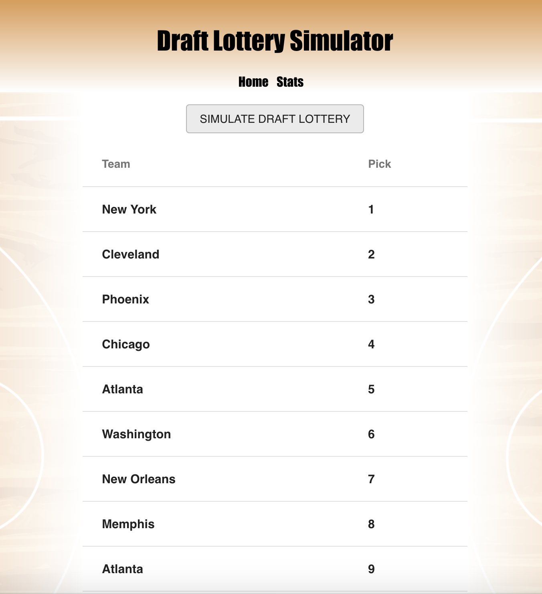
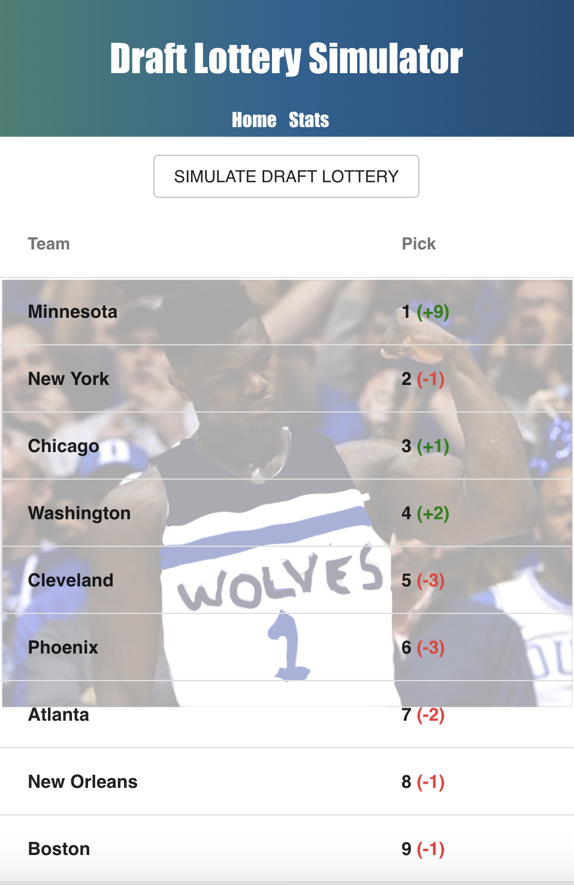
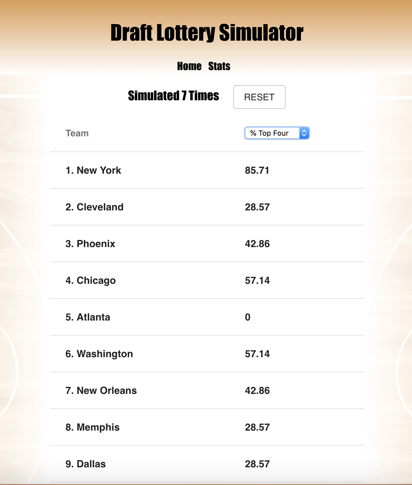

# NBA Draft Lottery Simulator

## Prerequisites/Software Used

### Setup

- Node.js
- Postico
- Terminal
- React
- React-Redux

## Installing

- Download project
- `npm install`
- `createdb draft_lottery`
- `use database.sql to insert necessary tables to database.`
- `npm run server`
- `npm run client`

## Description
#### This app will simulate the 2019 NBA Draft Lottery and show the results. The user can simulate the lottery as many times as they like and then they can navigate to the Stats Page to view the stats of all the simulations they ran. The Stats page shows the count of total simulations ran, a button to delete past simulations, and a table with teams and a dropdown to select a stat to display. Users can see the percent of times each team won a pick 1 -4, got into the top 4, and what pick each team recieved the most.

## Screen Shots

### 1 Home Page
#### This view shows the teams in their pre-lottery or post simulation order depending. A button for running the simulations is on this view.

### 2 Home Page (w/ Wolves winning a top 4 pick)
#### The styling changes to a Minnesota Timberwolves theme if the Wolves win a pick 1 - 4. If Minnesota wins pick 1 or 2 a picture of the consensus player for each pick will be the background of the table.

### 3 Stats Page
#### The table on this page shows the teams in their pre-lottery order and a dropdown to show a specific stat for each team. A counter is on this view to show the total simulations ran and a button is next to the counter to reset and delete simulations.

## Completed Features

- The Home Page shows a table of the teams in their pre-lottery order. The Simulate Draft Lottery button on this page will run the lottery and reorder the teams according to the lottery results. Teams will have a plus or minus next to their place to show how many places they dropped or moved up.
- If the Minnesota Timberwolves win a top four pick, the css stylings for the Home Page will change to a fun Timberwolves theme. If the Timberwolves win the first or second overall pick, the table that shows the teams in order will have a opaque picture of the consensus number 1 player or consensus number 2 player with a Minnesota jersey as its background. 
takes the user to the ordersheet(s) for the clicked order.
- The Stats Page shows the teams in their pre-lottery order. This view shows a counter for the number of times that the user has simulated the lottery. Next to this counter is a button to reset the stats by deleting the past simulations. The table on this view shows the teams in one column, and shows a dropdown menu to select a specific stat in the other column.
- The specific stats on the Stats Page shows every team's percent of times they received the first pick, second pick, third, fourth, and times they got a pick 1-4 out of all the simulations the user preformed. The last stat it displays is the team mode, which shows what pick each team received the most out of all the simulations the user preformed.
- The app will not show all of the stylings on mobile, but does show the tables and buttons nicely.

## Future Features

- I will add small team logos next to team names.
- I will add a hamburger menu.
- In future itterations of this project, I would like to include a mock draft to go along with the lottery results. This mock draft would show what player would be selected where given the results of the lottery.
- I will create a page called the 'Info Page' to explain to users how the draft lottery works, explain trades that can effect what team picks where, and explain the Stats Page and app in general. 

## Deployment

- Heroku: https://nba-draft-lottery-simulator.herokuapp.com/#/home

## Author

- Max Todd

## Acknowledgements

- I would like to thank my family and girlfriend for being patient with me, and for at least feigning interest every time I was excited about a breakthrough in this project. 
- I would like to thank my friends Mike and Sharmarke for looking over my code in places and giving their input.
- I will always be thankful to Prime Digital Academy for helping me get to the point where I can develop an app like this.

